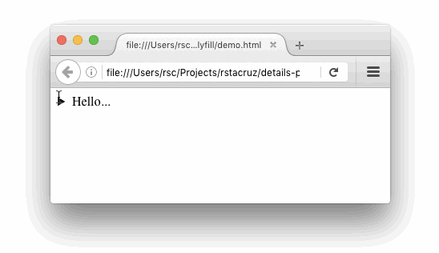

# details-polyill

> Polyfill for the HTML5 `<details>` element, no dependencies



<br>

Usage
-----

details-polyfill is available via npm.

```
npm install --save details-polyfill
```

Requiring it will immediately inject the needed behaviors.

```js
require('details-polyfill')
```

The file [index.js](index.js) is also usable as a standalone script.

<br>

How it works
------------

<details>
<summary>Just include the script on any page that uses <code>&lt;details&gt;</code>.</summary>

In case the browser doesn't support `<details>`, it adds the following behaviors:

  - When clicking `details > summary`, it toggles the `open` attribute in `details`.

It also adds these CSS styles:

  - `summary:before` is styled with a disclosure triangle.
  - `details:not([open]) > :not(summary)` elements are hidden. (that is: all children of closed `details`, except `summary`)
  - The `<html>` element gets the `no-details` class.
 
</details>

Limitations
-----------

<details>
<summary>Keep these guidelines in mind.</summary>

#### No loose text

The `<details>` element must not have loose text inside it. Everything inside it should be in elements.

```html
<!-- ✗ This will NOT work -->
<details>
  <summary>More info...</summary>
  No info available.
</details>
```

```html
<!-- ✓ But this will -->
<details>
  <summary>More info...</summary>
  <span>No info available.</span>
</details>
```

#### Don't style summary::before
...unless it's for a disclosure triangle. This library uses `summary::before` to create a default triangle.

#### Summary as first child
The `summary` element must also be the first child of the `details` element. Browsers supporting the `details` element natively will hoist `summary` elements up, but details-polyfill.js won't.

#### JavaScript `el.open = true`
...will not work like how you think it does. You also need to do `.setAttribute('open', 'open')` or `.removeAttribute('open')`.

</details>


Alternatives
------------

<details>
<summary>Here are a few other polyfills for <code>&lt;details&gt;</code>.</summary>

I wrote this because everything else out there either depend on big libraries, or are too complicated. In contrast, `details-polyfill` has <100 lines of code, and only comes with a *.js* file.

* [better-details-polyfill](https://github.com/chemerisuk/better-details-polyfill) - depends on better-dom-boilerplate.
* [manuelbieh/Details-Polyfill](https://github.com/manuelbieh/Details-Polyfill) - depends on jQuery.
* [html5-details-jquery](https://mathiasbynens.be/notes/html5-details-jquery) - depends on jQuery.
* [jquery-deets](https://github.com/Akkuma/jquery-deets) - depends on jQuery UI.
* [Element.details](https://github.com/termi/Element.details) - supports legacy IE, but is harder to implement (has `.htc` files).
* [Complete polyfill for the HTML5 details element](https://www.smashingmagazine.com/2014/11/complete-polyfill-html5-details-element/) (smashingmagazine.com)
* [Cross browser polyfills](https://github.com/Modernizr/Modernizr/wiki/HTML5-Cross-browser-Polyfills#details-and-summary) (github.com/modernizr)

</details>

Thanks
------

**details-polyfill** © 2016+, Rico Sta. Cruz. Released under the [MIT] License.<br>
Authored and maintained by Rico Sta. Cruz with help from contributors ([list][contributors]).

> [ricostacruz.com](http://ricostacruz.com) &nbsp;&middot;&nbsp;
> GitHub [@rstacruz](https://github.com/rstacruz) &nbsp;&middot;&nbsp;
> Twitter [@rstacruz](https://twitter.com/rstacruz)

[MIT]: http://mit-license.org/
[contributors]: http://github.com/rstacruz/details-polyfill/contributors
